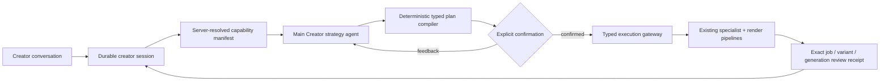

# Creator Agent Architecture

Nova's long-term vision: a **personalized AI agent per creator** that knows their
style, plans their content, guides their filming, and renders every edit to their
taste — while letting them override anything they want.

## Main Creator Agent (V1 foundation plus dark staged slices)

The style milestones below personalize individual decisions, but they do not own
an edit. Before V1, Nova's architecture had three concrete gaps:

1. specialist agents could disagree because no durable controller owned the
   creative thesis;
2. product capabilities were inferred from prompts instead of resolved from live
   flags, ownership, renderer compatibility, and limits;
3. model output could jump directly to bespoke mutations, with no single typed,
   revision-fenced confirmation boundary.

The Main Creator Agent fixes those gaps. It is deliberately **not** a general
ReAct loop. The model makes a semantic decision; deterministic product code owns
state, validation, execution, and budgets.



### V1 user experience

On a plan item, the creator opens **Create with Kria** and describes the desired
feeling or story. Kria sees the creator profile, item idea, owned footage summaries,
current edit, and live product capabilities. It either asks one material question
or presents one opinionated direction: format, audio, story beats, hook, captions,
pacing, and available treatments. Nothing renders until **Render this** is clicked.

After confirmation, the server re-resolves the manifest and rejects stale plans.
For guided-compatible stories it translates the creative thesis into the existing
guided planner's `ProposalBrief`; that specialist receives a deterministic,
render-capable shortlist of at most 32 media sources under per-call aliases such
as `m001`. The complete accepted media universe remains in the server-owned
proposal snapshot and editor, so bounding the model call never drops uploads.
The confirmed request can carry the typed `mixed_media_timing` profile: photos use
0.5–0.8s holds, usable videos use 1.5–3.0s holds when source footage permits,
and fast-montage boundaries are hard cuts. The profile is compiled through the
proposal snapshot and deterministic fallback; absent the profile, legacy timing
limits remain unchanged.
Audio-led and voiceover formats always use the native renderer. The existing
`dispatch_item_render_for` gateway mints the Job. V1 then follows that exact Job
and records its selected ready variant and `render_generation_id`. The creator can
give feedback and confirm at most one revision (two renders total). When Stage 2
review is enabled, the exact ready generation is queued for the objective
`video_quality_grader`; the resulting evidence and confirmation-gated revision
proposal are shown as feedback, never applied automatically by V1 or Stage 2.

### Trust boundaries

- The model receives opaque media/catalog IDs, never GCS paths, signed URLs,
  credentials, database access, FFmpeg, or route callables.
- `ResolvedCreatorManifest` is descriptive. It contains live availability reasons,
  render compatibility, current-edit identity, and bounded limits.
- `CreatorEditPlan` is non-executable and pins both `manifest_hash` and
  `context_hash`.
- Confirmation is a CAS over session revision, plan version/hash, manifest hash,
  creator ownership epoch, and an idempotency key.
- Execution routes re-check feature flags and ownership. Uploaded overlays and
  user SFX must belong to the exact PlanItem; curated licensed assets keep their
  separate catalog policy.
- AI analysis is marked as evidence-only in the footage context. The prompt
  forbids copying filenames or AI metadata into visible text. Existing renderer
  provenance guards remain authoritative.
- The proposed `intro_hook` is an opening concept for approval, not trusted
  render copy. Native execution still runs the existing grounded `intro_writer`;
  Main Creator output is never burned verbatim onto the video.
- V1 and the implemented Stage 2/3 slices remain confirmation-gated. Stage 4 is
  an implemented, default-off automatic revision route. It requires explicit
  per-session opt-in and re-evaluates every objective-quality, budget, allowlist,
  pin, and one-cycle guard server-side before compiling one existing craft
  command. Turning on the flag does not opt a session in.
- Native plans resolve confirmed opaque media IDs back to that exact item's clip
  assignments; an asset-only native selection fails closed instead of rendering
  unrelated footage. Native selection is normalized to at most 12 owned non-asset
  IDs. Guided strategies carry no selected IDs; the guided proposal owns exact
  media selection from its bounded shortlist while retaining the full accepted
  universe in the snapshot.
- A running confirmation receipt is resumable after process death. Reconciliation
  accepts only a Job for the same creator, PlanItem, ownership epoch, and a creation
  time after the confirmation receipt; native Jobs must also carry the exact
  confirmed strategy snapshot.

### Persistence

`creator_agent_sessions` stores one durable state machine per creator/item with
revision, ownership epoch, pending plan, exact render target, question/agent/render
budgets, last review, last good output, and stable failure details. A partial
unique index permits only one active session per creator/item.

`creator_agent_events` is an append-only conversation/controller log. Sequence
and client-event uniqueness provide ordering and retry idempotency; a database
trigger rejects updates. `creator_agent_executions` stores idempotent confirmation
receipts and request digests. `agent_runs.creator_agent_session_id` connects every
model invocation to the durable session without inventing a Job ID.

Stage 2 stores its review receipt in the session's `last_review` envelope. The
receipt pins creator, PlanItem, ownership epoch, Job, variant, and
`render_generation_id`, plus bounded timestamped evidence and (when needed) one
revision proposal. Review claims and writes are exact-generation fenced; a stale
target or grader failure becomes a visible unavailable/failed review and leaves
the render untouched.

Stage 4 stores `auto_iteration_opt_in` and `automatic_revision_count` on the
session. Migration `0087_creator_auto_iteration` adds both columns and constrains
the automatic count to `0..1`; the default is opt-out and the count is a durable
one-cycle cap.

### V1 API

All routes are authenticated, item-owner-scoped, and live under `/plan-items/{id}`:

| Route | Contract |
|---|---|
| `GET /creator-agent/session` | Poll latest session and reconcile exact Job state |
| `POST /creator-agent/session` | Start/reuse active session and submit first message |
| `POST /creator-agent/turn` | Revision-fenced feedback or clarification turn |
| `POST /creator-agent/confirm` | Explicit, hash-pinned execution confirmation |
| `POST /creator-agent/craft` | Exact-generation, idempotent Stage 3 craft bundle |
| `POST /creator-agent/auto-iteration` | Explicitly opted-in, one-cycle Stage 4 objective revision |
| `POST /creator-agent/cancel` | Cancel a non-rendering active session |

The public response contains conversation events, session status/revision, render
budget, pending plan preview, target Job ID, and a bounded Stage 2 review envelope.
It never returns raw command capabilities or storage identities.

### Stage 2 — evidence critic (implemented dark)

When `MAIN_CREATOR_AGENT_REVIEW_ENABLED` and its child gate
`MAIN_CREATOR_AGENT_QUALITY_REVIEW_ENABLED` are both enabled, a successful exact
render queues `tasks.creator_quality_review` once per
`session:job:variant:generation` key. The worker downloads only the fenced ready
generation and calls the existing `video_quality_grader` adapter (Gemini
2.5 Flash, prompt version `2026-08-25.3`). It persists an objective receipt with
quality/confidence, up to 12 timestamped visual/audio/timing/caption/structure
observations, and at most one revision proposal linked to evidence IDs.

Review is fail-open for creator delivery: stale targets, enqueue failures, missing
review targets, and grader errors become explicit unavailable/failed receipts and
manual feedback remains available. A `revise` result is a confirmation-gated
recommendation;
the creator must still confirm the next render. There is no claim here that a
Director pass or automatic taste judgment is implemented by this slice.

### Stage 3 — typed craft (implemented dark)

`POST /plan-items/{id}/creator-agent/craft` accepts one bounded, hash-pinned
`CreatorCraftBundle` against the exact Job/variant/generation and routes it through
the existing transactional editor commit or speech-cut candidate state machine.
The supported commands are:

- `set_caption_style` (`sentence` or `word`);
- `set_transition` (hard cut, crossfade, dip-to-black, or flash; wipe is rejected
  by the current timeline editor);
- `set_look_preset` (the existing safe look vocabulary);
- `set_media_overlay` (owner-checked PlanItem asset, overlay-only bundle);
- `set_licensed_sfx` (server-resolved catalog item); and
- `apply_speech_cut` (an existing silence/retake candidate with its cut revision).

The route re-checks creator/session/ownership/manifest/generation pins, accepts no
paths or URLs, uses an idempotency receipt, and rolls back a committed editor state
if queue publication fails. Treatment availability is resolved from its existing
independent flag: transitions, looks, media overlays, sound effects, and
automatic speech cuts are never enabled merely because the Creator Agent is on.
Media overlays cannot be combined with core commands in one bundle. Craft is a
separate post-render operation; it does not create a new Main Creator strategy
or bypass the confirmation boundary.

### Stage 4 — bounded automatic iteration (implemented dark, default off)

`POST /plan-items/{id}/creator-agent/auto-iteration` is the explicit opt-in
entry point. The caller supplies `session_id`, `expected_revision`, `opt_in=true`,
and a `client_event_id`; `opt_in=false` is rejected. The route requires the
master rollout and execution gates plus
`MAIN_CREATOR_AGENT_REVIEW_ENABLED`,
`MAIN_CREATOR_AGENT_QUALITY_REVIEW_ENABLED`, and
`MAIN_CREATOR_AGENT_AUTO_ITERATION_ENABLED`. Enabling the flag alone does not
enroll sessions.

The server evaluates the exact completed objective review and proceeds only if
all of these gates pass: `confidence >= 0.85`, `quality_score < 4.0`,
`expected_improvement >= 0.5`, remaining render budget is positive,
`automatic_revision_count < 1`, and `objective_tag == "objective_quality"`.
The proposed action must be exactly one of the allowlisted actions:
`transition_fallback`, `caption_legibility`, `remove_optional_treatment`, or
`speech_cut`. These compile to existing typed commands only: a no-transition
fallback, sentence captions, removal of one existing `media_overlay` or `sfx`,
or an already pending speech-cut candidate from an approved review source.
New media, voiceover, publishing, external assets, training enrollment, and
taste-ambiguous changes are excluded. Render budget is only a positive
remaining-budget gate; `objective_tag` remains exactly `objective_quality` and
is not user-controlled.

Every command carries exact creator/session/PlanItem/job/variant/generation,
manifest/context, revision, and ownership-epoch pins. The stable key
`creator-auto:{session_id}:{target_generation_id}` makes retries idempotent;
an existing prepared craft receipt is recovered through the normal craft path,
and duplicate client events return the existing result. A successful cycle
increments `automatic_revision_count` and records a `last_good` rollback receipt
containing the prior generation and assembly plan. Craft or render failure is
fail-open: the current video remains unchanged, the session is available for
manual feedback, and the stored receipt is the recovery point.

### Delegation policy

The Main Creator calls no specialist merely because one exists. V1 delegates only
when a specialist owns a stronger typed contract:

- guided-compatible story → `edit_proposal` via a confirmed `ProposalBrief`;
- native render → existing format/audio dispatch, whose pipeline may invoke
  `music_matcher`, `intro_writer`, caption, sequence, and treatment specialists;
- render completion → structural exact-generation receipt; the Stage 2
  `video_quality_grader` review is queued only for the exact ready generation.
- post-render taste changes → Stage 3's existing editor commit/speech-cut gateways;
  the Main Creator compiles commands but never receives renderer capabilities.

Specialist failure never grants the Main Creator a broader capability. A terminal
guided-story or fast-montage planning failure may recover through neutral,
server-authored structure built only from owned media. That recovery is accepted
only after the strict renderer validates its timing and source windows; otherwise
it fails closed. `text_explainer` remains semantic and fails closed instead of
rebinding copy to arbitrary footage. Native music matching retains its existing
original-audio fallback.

### Good-enough and failure policy

V1's automatic quality floor is structural: the confirmed Job reaches a ready
state, a ready variant exists, and its immutable generation identity is recorded.
It then asks the creator for the taste judgment. Stage 2 adds Director/visual/audio
rubrics and can recommend one revision, but still requires confirmation.

Failures are stable and bounded: missing media asks the creator to upload; a stale
manifest returns 409 and requires re-planning; unavailable voiceover cannot be
activated; an active render cannot be cancelled through this controller; dispatch
failure saves the confirmed plan and a typed execution error; Main Creator output
is normalized at the model boundary; eligible guided specialist failures use the
strictly validated deterministic recovery above; render failure preserves the
plan for a fresh session. No branch generates raw media operations.

### Rollout

Backend switches default off:

- `MAIN_CREATOR_AGENT_ENABLED`
- `MAIN_CREATOR_AGENT_EXECUTION_ENABLED`
- `MAIN_CREATOR_AGENT_REVIEW_ENABLED`
- `MAIN_CREATOR_AGENT_QUALITY_REVIEW_ENABLED` (requires review)
- `MAIN_CREATOR_AGENT_AUTO_ITERATION_ENABLED`
- `EDIT_FORMAT_DAY_VLOG_ENABLED`
- `EDIT_FORMAT_SINGLE_HERO_ENABLED`
- `MAIN_CREATOR_AGENT_FREEFORM_UPLOADS_ENABLED`
- `MAIN_CREATOR_AGENT_WORKSPACE_ENABLED`
- `MAIN_CREATOR_AGENT_ROLLOUT_PERCENT` (stable user bucket, default `0`)

Frontend exposure is separately gated by
`NEXT_PUBLIC_MAIN_CREATOR_AGENT_ENABLED`. Rollout order is migration/API first,
then conversation at 1%, then execution at internal-only/1%, then reviewed cohort
expansion. Do not expose the frontend before the Fly capability and execution
flags are live.

### Stages 1–5

1. **V1 — confirm one creative strategy (implemented dark):** one PlanItem,
   opaque manifest, one question, typed plan, explicit initial render and revision
   confirmation, two-render budget, structural exact-generation review.
2. **Stage 2 — evidence critic (implemented dark):** review the exact ready
   generation with `video_quality_grader`, persist bounded evidence, and offer one
   evidence-linked revision proposal. User confirmation remains mandatory.
3. **Stage 3 — typed craft (implemented dark):** compile caption, transition, look,
   licensed SFX, owner-scoped media-overlay, and speech-cut commands into the
   existing safe editor/candidate routes. Each command has an independent live
   capability gate and exact-generation receipt.
4. **Stage 4 — bounded autonomy (implemented dark, default off):** the explicit
   auto-iteration route requires per-session opt-in, completed objective review,
   `confidence >= 0.85`, `quality_score < 4.0`, `expected_improvement >= 0.5`, a
   positive remaining budget, the `objective_quality` tag, and one exact action
   from the four-action allowlist. It compiles at most one exact-pinned command,
   uses the stable generation idempotency key, recovers prepared receipts, and
   records the prior generation as a rollback receipt. The schema and route are
   implemented behind `MAIN_CREATOR_AGENT_AUTO_ITERATION_ENABLED=false` by
   default. The exclusions are taste-ambiguous changes, new media, voiceover,
   publishing, external asset acquisition, training enrollment, and inferred
   preferences.
5. **Stage 5 — creator workspace ownership (implemented dark, independently gated):**
   approval-gated off-plan relevance proposals, plan-level multi-deliverable
   receipts, and explicit preference signals/style edits. Publishing, external asset
   acquisition, training enrollment, and implicit preference inference remain out
   of scope.

### Tests and evals

- schema tests reject paths/URLs, unknown commands, stale hashes, unknown media,
  unavailable treatments, and guided audio-led plans;
- persistence tests pin constraints, append-only triggers, indexes, aliases, and
  AgentRun correlation;
- route/controller tests pin voiceover gating and specialist-brief delegation;
- Stage 2 tests pin stable review task IDs, exact-generation claims, bounded
  evidence, stale-target rejection, and fail-open grader errors;
- Stage 3 tests pin command schemas, independent capability gates, exact target
  pins, owner-scoped overlays/SFX, atomic editor commits, and enqueue rollback;
- M6 tests pin renderer-version markers, strict day-vlog chronology/transitions/
  duration, and single-hero ownership/dominance/duration policies;
- Stage 4 tests pin objective thresholds, explicit opt-in, exact allowlist,
  one-cycle recovery, command pins, idempotency, and prior-generation rollback
  receipts;
- Stage 5 tests pin 0085/0086/0088/0089 state, idempotent proposal decisions, ownership
  re-fencing, distinct deliverables, stale receipts, and explicit-only preference
  writes;
- large-media tests pin 45 clips plus 58 ready visuals, incremental analysis
  checkpoints and retry reuse, the 12-ID Main Creator native bound, the 32-alias
  specialist prompt, exact alias resolution, typed mixed-media timing, and full
  snapshot/editor-universe preservation;
- fallback tests pin non-overlapping fast cuts, renderer validation before guided
  auto-approval, and fail-closed `text_explainer` behavior;
- editor regressions pin exact PlanItem ownership for overlays/SFX and the music
  commit crash repair;
- frontend tests prove no confirmation call occurs before **Render this**;
- `tests/evals/test_main_creator_evals.py` runs replay/live agent evaluation with a
  rubric for decisiveness, grounding, capability compliance, and no invention.

## Why this document exists

Today the pieces are disconnected:

| Signal | Reaches |
|---|---|
| Persona (TikTok + interview) | Hook *wording* only |
| Typography / style | Per-render, from clip content, not the user |
| Filming guide | UI display only — never reaches the renderer |
| Persona edits | Nothing — no propagation |

A user with an aesthetic city-walk persona and a user uploading gym content get the
same style-set selection if their footage happens to look the same. The Creator Agent
architecture fixes this.

---

## Canonical state model

Three durable per-user rows drive everything:

```
personas
  ├── questionnaire     (user answers from the chat interview)
  ├── tiktok_profile    (scraped + LLM-enriched profile)
  ├── persona           (AI-authored: summary, pillars, tone, audience, ...)
  └── style             (M1) UserStyle JSONB — pinned set + knob overrides
                             + footage_type_bias + instruction_level + status

content_plans
  └── plan_items[]
        ├── theme / idea / filming_guide
        ├── edit_format
        └── current_job_id (→ jobs)

creator workspace (Stage 5)
  ├── creator_workspace_proposals          (off-plan relevance, migration 0085)
  ├── creator_workspace_receipts           (plan-level coordination, migration 0086)
  ├── creator_workspace_deliverables       (one exact session/Job target per item)
  └── creator_workspace_preference_signals (creator-authored notes/style edits)

creator-agent session autonomy (Stage 4, migration 0087)
  ├── auto_iteration_opt_in                (explicit per-session opt-in)
  └── automatic_revision_count             (durable 0..1 cycle cap)
```

**Per-job snapshot:** at job mint time the caller copies the persona/style/plan
context into `Job.all_candidates` (existing pattern). The orchestrator reads
`all_candidates` during async render so it never races the canonical row. A persona
edit after the job is queued doesn't silently change the in-flight render.

**Intent-driven re-tune:** user action (chat / PATCH) → structured task → read-merge-
write the canonical row. The next job mint picks up the new values automatically.
This is the existing `retune_persona_from_feedback` + `PATCH /personas/{id}` pattern;
the M2 conversational agent emits intents onto these same tasks.

---

## Propagation model

```
User edits persona tone
    └─► retune_persona_from_feedback.delay()
            └─► PersonaGeneratorAgent
                    └─► row.persona updated (ready)
                            └─► derive_user_style.delay()  (M1)
                                    └─► StyleDerivationAgent
                                            └─► row.style updated (ready)

Next plan item renders:
    _dispatch_item_render → build_generative_job(user_style=row.style)
                                → all_candidates["user_style"] = validated style
                                → orchestrate_generative_job reads it
                                → _resolve_intro_overlay_params applies knobs
```

Changes propagate to **future edits only** — never retroactively to completed jobs.
This is by design: retroactive re-render would break delivered content.

---

## Invariants

**Byte-identity-when-absent:** when `USER_STYLE_ENABLED=false` OR `style IS NULL`,
`all_candidates` has no `user_style` key. `_resolve_intro_overlay_params` with
`user_style_knobs=None` produces byte-identical output to pre-M1.

**"User's say wins":** `style.status == "edited"` → `derive_user_style` skips the
row (both initial and post-retune chains). Only `POST /personas/style/rederive`
(explicit user request) can overwrite an edited style (`force=True`).

**Parity-safe knob set (#296):** `StyleKnobs` uses `extra="forbid"`. Every field in
`StyleKnobs` MUST be confirmed to work in BOTH the Pillow renderer (`text_overlay.py`)
and the Skia renderer (`text_overlay_skia.py`). `effect` is deliberately excluded
pending Skia parity verification. Guard: `tests/test_user_style_schema.py::TestStyleKnobaParitySafety`.

**Precedence chain (most-specific wins):**
- Style set: per-variant `dispatch_change_style` > user-style pinned id > agent-selected > "default"
- Size: per-variant `size_override_px` (source "user") > user-style `text_size_px` (source "user_style") > curated-set px > `compute_overlay_size` (source "computed")
- Other knobs: user-style knob > curated-set value > agent advisory > hardcoded default

**Per-variant knob persistence:** `user_style_knobs` is stored in the variant entry
dict on `Job.assembly_plan["variants"]` alongside `style_set_id`/`intro_text_size_px`.
Re-renders (`regenerate_generative_variant`) read it back from the variant entry,
not the current persona row — so re-renders are hermetic even if the user's style
changed between the first render and the swap-song/retext.

---

## Milestones

### M1 — User Style entity ✓ SHIPPED dark (`USER_STYLE_ENABLED=false`)

**What's shipped:**
- `personas.style` JSONB column (migration 0050)
- `StyleKnobs` + `UserStyle` schemas (`app/agents/_schemas/user_style.py`)
- `StyleDerivationAgent` (`nova.plan.style_derivation`) with prompt + eval rubric
- `derive_user_style` Celery task — chained from `generate_persona` + `retune_persona_from_feedback`
- Render wiring: `build_generative_job(user_style=...)` → `all_candidates["user_style"]`; `_resolve_intro_overlay_params(user_style_knobs=...)` applies knobs with correct precedence
- API: `GET /personas/style`, `PATCH /personas/style` (→ status="edited"), `POST /personas/style/rederive`
- Kill switch: `USER_STYLE_ENABLED=false` (default)
- **M1-FE:** `StyleCard` in workspace left rail (5 render states); links to `/plan/style`

### M2 — Conversational agent ✓ SHIPPED dark (`STYLE_AGENT_ENABLED=false`)

`StyleIntentAgent` (`nova.plan.style_intent`) parses free-text style utterances into 5
typed intents. Editorial-interview frontend at `/plan/style` (`StyleAgentInterview`
component — no chat bubbles, clean Q&A flow). API routes:
- `POST /personas/agent/start` — personalized greeting + opening chips
- `POST /personas/agent/turn` — stateless single-shot intent dispatch (both return 404 when flag off)

Remaining open items (post-flag-flip):
- Scope reduction intent (stop filming X) → `PATCH /content_plans/{id}` category edit (new)

### M3 — Style-driven plan + filming guide in render ✓ SHIPPED dark (reads `USER_STYLE_ENABLED`)

- Planner reads `style.instruction_level` + `preferred_edit_format_mix` → plan items get
  per-day `filming_guide` (2–4 shot keys keyed to `edit_format`) injected as context for
  `intro_writer`'s hook; `CONTENT_PLAN_PROMPT_VERSION` → `2026-06-07`
- `_resolve_archetype`: soft `footage_type_bias` tiebreaker biases toward user's declared
  footage preference (transparent when bias absent — byte-identical baseline)

### M4 — Per-item conformance feedback ✓ SHIPPED dark (`CONFORMANCE_FEEDBACK_ENABLED=false`)

- Migration 0051: nullable `conformance` JSONB on `plan_items`
- `ConformanceFeedbackAgent` (`nova.plan.conformance_feedback`) — Gemini Flash, best-effort,
  fire-and-forget after `attach_clips` commit (max_retries=0, soft_time_limit=120s)
- Verdict panel on plan-item page (lime/amber/red); never blocks Generate
- Instructed items (instruction_level ≠ "none") get single-file replace UI
- Kill switch: `CONFORMANCE_FEEDBACK_ENABLED=false` (default)

### M5 — Freeform / off-plan uploads

- `POST /content-plans/{plan_id}/workspace/relevance-proposals` accepts opaque
  authenticated upload Job IDs, owner-checks them, and snapshots their identities.
  `tasks.detect_plan_relevance` classifies the snapshot against the plan without
  mutating a plan, item, or render.
- A `ready` proposal is one of `existing_item`, `new_topic`, or `unmatched`. The
  creator must explicitly choose `accept_existing`, `accept_new_topic`, or
  `reject` through the hash- and client-event-fenced decision route. Acceptance
  re-checks ownership/epoch and the live upload paths before attaching footage or
  creating a new montage PlanItem; it never auto-fulfils or silently closes an item.
- Proposal creation and decisions are idempotent. Stale ownership, changed
  proposal hashes, deleted uploads, or mismatched targets fail closed with a
  visible conflict. The relevance agent does not infer preferences or acquire
  external media. Editing the resulting item still follows the normal style and
  render gates.

### M6 — `day_vlog` and `single_hero` assemblers

Full format support for the two strict guided renderers in the `edit_format`
contract. They are independently gated behind `EDIT_FORMAT_DAY_VLOG_ENABLED` /
`EDIT_FORMAT_SINGLE_HERO_ENABLED` (default off).

`day_vlog` is now implemented behind `EDIT_FORMAT_DAY_VLOG_ENABLED` (default
off). Its worker path is strict: it requires at least two usable filming-guide
shots, preserves their first-appearance order, allows only hard cuts or
crossfades up to 0.2s, and rejects output outside the footage/product duration
bound instead of downgrading to montage. API-created jobs pin a renderer-version
marker so mixed API/worker deploys fail closed when the marker is missing or
incompatible. The capability manifest reports `disabled_by_setting` while the
flag is off. Production parity still needs `make local-render` with representative
multi-shot day-vlog footage; no local-render artifact is claimed by unit tests.

`single_hero` is implemented behind `EDIT_FORMAT_SINGLE_HERO_ENABLED`. It needs
one usable hero and at least one usable cutaway (at least two clips total), picks
the deterministic highest-hook-score hero, allows at most three supporting
cutaways, opens with the hero, uses each supporting clip once, and requires the
hero to occupy at least 60% of the output (with a 3s minimum hero source window).
The output is bounded by available footage and the product maximum. A policy
failure is typed (`insufficient_media`, `hero_ownership_violation`,
`hero_dominance_violation`, or `duration_out_of_bounds`) and never downgrades to
montage. API jobs pin `single_hero_renderer_version=1`; workers reject a missing
or incompatible marker and re-check the kill switch. Its capability manifest
reports `disabled_by_setting` while off. Both formats require representative
production-image local renders before a rollout; unit tests do not substitute for
that evidence.

The strict worker boundary also rejects a voiceover contract for either format.
The frontend must not advertise either format until the backend capability and
renderer flags are live. `NARRATIVE_CLIP_ORDER_ENABLED` is a dependency for the
day-vlog chronology policy; disabling it makes strict day-vlog fail closed.

### Stage 5 workspace coordination and explicit preferences

`MAIN_CREATOR_AGENT_FREEFORM_UPLOADS_ENABLED` gates off-plan proposals;
`MAIN_CREATOR_AGENT_WORKSPACE_ENABLED` gates coordination receipts and preference
signals separately. Its build-time frontend twin,
`NEXT_PUBLIC_MAIN_CREATOR_AGENT_WORKSPACE_ENABLED`, exposes explicit preference
controls before a coordination receipt exists; enable the Fly flag before the
Vercel twin. A proposal stores ownership epoch, idempotency/request digest,
opaque media IDs, and an owner-checked media snapshot in `creator_workspace_proposals`
(migration `0085`). A workspace receipt stores one distinct Creator session per
PlanItem, position, ownership epoch, and exact Job/variant/generation receipt in
`creator_workspace_receipts` and `creator_workspace_deliverables` (migration
`0086`). Polling marks a receipt `stale` if the plan/session/Job ownership epoch
or exact target no longer matches; it never guesses a replacement deliverable.

Migration `0088` adds a durable `processing` claim for relevance classification.
A failed publish is visible and retryable; redelivery claims the same proposal
instead of running a second classifier, and approval rejects a source path already
attached to another plan item. Legacy upload Jobs do not persist a GCS object
generation, so those proposals remain path- and ownership-pinned; existing
`PlanItemAsset` generation pinning is unchanged.

Migration `0089` adds the partial/latest-session and child-side foreign-key
indexes used by workspace polling. Relevance context is capped at 200 plan items
and fails visibly when the plan exceeds that agent contract; receipt creation
selects only the newest complete session per requested item, and cross-item media
reuse is checked with an indexed database existence query rather than loading plan
history into API memory.

The receipt endpoints are:

| Route | Contract |
|---|---|
| `POST /content-plans/{id}/workspace/receipts` | Create/reuse an idempotent plan-level coordination receipt |
| `GET /content-plans/{id}/workspace` | Poll the latest receipt |
| `GET /content-plans/{id}/workspace/receipts/{receipt_id}` | Poll one receipt |
| `POST /content-plans/{id}/workspace/preference-signals` | Record an explicit creator note and optional style edit |

The proposal endpoints are `POST/GET /content-plans/{id}/workspace/relevance-proposals`
and `POST .../{proposal_id}/decision`. Preference signals are always
`source=creator_explicit`; notes are sanitized creator text and feed the bounded
plan preference summary. An optional `style_edit` is accepted only when
`USER_STYLE_ENABLED` is on, is merged into the UserStyle row with `status="edited"`,
and remains explicit creator input. No model output, relevance classification,
render outcome, or browsing behavior may become an inferred preference. These
routes do not publish, acquire external assets, enroll training, or silently
promote a proposal.

---

## Enabling in production

The staged Creator Agent rollout, mixed-worker precautions, migrations, kill
switches, canary checks, and verification ledger live in
[the Creator Agent rollout runbook](../runbooks/creator-agent-rollout.md). Keep
all backend flags off until migrations and both API/worker code are live.

```bash
# After live-eval validation of StyleDerivationAgent output quality:
fly secrets set USER_STYLE_ENABLED=true --app nova-video
fly machine restart <worker-machine-id>

# The next persona generation or retune will auto-derive styles.
# Monitor: fly logs --app nova-video | grep style_build
```

Backfill existing personas (optional, once enabled):

```python
# Admin script — queue derive_user_style for all personas with status="ready"
from app.models import Persona
from app.tasks.style_build import derive_user_style
# ... query ready personas, derive_user_style.delay(str(p.id)) for each
```

---

## Key files

| File | Role |
|---|---|
| `app/agents/_schemas/user_style.py` | `StyleKnobs` + `UserStyle` + coerce helpers |
| `app/agents/style_derivation.py` | `StyleDerivationAgent` |
| `src/apps/api/prompts/derive_user_style.txt` | Agent prompt template |
| `app/tasks/style_build.py` | `derive_user_style` Celery task |
| `app/migrations/versions/0050_persona_style.py` | `personas.style` column |
| `app/routes/personas.py` | Style API routes (GET/PATCH/rederive) |
| `app/services/generative_jobs.py` | `_build_user_style_context`, `build_generative_job` |
| `app/tasks/generative_build.py` | `_resolve_intro_overlay_params` (single source of truth for knob precedence) |
| `tests/test_user_style_schema.py` | Parity-safe guard + byte-identity contract |
| `tests/evals/test_style_derivation_evals.py` | Style derivation eval harness |
| `tests/evals/rubrics/style_derivation.md` | LLM judge rubric |
| `app/services/creator_capabilities.py` | Live manifest and format/treatment gates |
| `app/services/creator_craft.py` | Deterministic Stage 3 bundle compiler |
| `app/services/creator_autonomy.py` | Stage 4 objective gates, allowlist, and pinned command compiler |
| `app/tasks/creator_quality_review.py` | Exact-generation Stage 2 critic coordinator |
| `app/routes/creator_agent.py` | V1 session, craft, and receipt-fenced execution routes |
| `app/routes/creator_workspace.py` | Stage 5 proposal, receipt, and preference routes |
| `app/tasks/creator_workspace.py` | Crash-resumable off-plan relevance task |
| `app/tasks/generative_build.py` | Strict day-vlog/single-hero policies and worker fences |
| `app/migrations/versions/0081_creator_agent_sessions.py` | V1 session/event/execution persistence |
| `app/migrations/versions/0085_creator_workspace_proposals.py` | Off-plan proposal persistence |
| `app/migrations/versions/0086_creator_workspace_receipts.py` | Workspace receipts/deliverables/preferences |
| `app/migrations/versions/0087_creator_auto_iteration.py` | Explicit opt-in and one-cycle auto-iteration state |
| `app/migrations/versions/0088_creator_workspace_proposal_processing.py` | Durable relevance-processing claim and retry state |
| `app/migrations/versions/0089_creator_workspace_query_indexes.py` | Bounded workspace lookup and child-side foreign-key indexes |
| `tests/tasks/test_creator_quality_review.py` | Stage 2 exact-target/fail-open tests |
| `tests/services/test_creator_craft.py` | Stage 3 compiler tests |
| `tests/services/test_creator_autonomy.py` | Stage 4 thresholds, allowlist, pins, idempotency, and recovery tests |
| `tests/routes/test_creator_workspace.py` | Stage 5 approval/explicit preference tests |
| `tests/tasks/test_generative_dispatch.py` | M6 strict policy tests |
