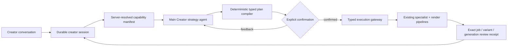

# Creator Agent Architecture

Nova's long-term vision: a **personalized AI agent per creator** that knows their
style, plans their content, guides their filming, and renders every edit to their
taste — while letting them override anything they want.

## Main Creator Agent (V1 foundation, dark)

The style milestones below personalize individual decisions, but they do not own
an edit. Before V1, Nova's architecture had three concrete gaps:

1. specialist agents could disagree because no durable controller owned the
   creative thesis;
2. product capabilities were inferred from prompts instead of resolved from live
   flags, ownership, renderer compatibility, and limits;
3. model output could jump directly to bespoke mutations, with no single typed,
   revision-fenced confirmation boundary.

The Main Creator Agent fixes those gaps. It is deliberately **not** a general
ReAct loop. The model makes a semantic decision; deterministic product code owns
state, validation, execution, and budgets.



### V1 user experience

On a plan item, the creator opens **Create with Kria** and describes the desired
feeling or story. Kria sees the creator profile, item idea, owned footage summaries,
current edit, and live product capabilities. It either asks one material question
or presents one opinionated direction: format, audio, story beats, hook, captions,
pacing, and available treatments. Nothing renders until **Render this** is clicked.

After confirmation, the server re-resolves the manifest and rejects stale plans.
For guided-compatible stories it translates the creative thesis into the existing
guided planner's `ProposalBrief`; that specialist owns exact beat/media planning.
Audio-led and voiceover formats always use the native renderer. The existing
`dispatch_item_render_for` gateway mints the Job. V1 then follows that exact Job
and records its selected ready variant and `render_generation_id`. The creator can
give feedback and confirm at most one revision (two renders total).

### Trust boundaries

- The model receives opaque media/catalog IDs, never GCS paths, signed URLs,
  credentials, database access, FFmpeg, or route callables.
- `ResolvedCreatorManifest` is descriptive. It contains live availability reasons,
  render compatibility, current-edit identity, and bounded limits.
- `CreatorEditPlan` is inert and pins both `manifest_hash` and `context_hash`.
- Confirmation is a CAS over session revision, plan version/hash, manifest hash,
  creator ownership epoch, and an idempotency key.
- Execution routes re-check feature flags and ownership. Uploaded overlays and
  user SFX must belong to the exact PlanItem; curated licensed assets keep their
  separate catalog policy.
- AI analysis is marked as evidence-only in the footage context. The prompt
  forbids copying filenames or AI metadata into visible text. Existing renderer
  provenance guards remain authoritative.
- The proposed `intro_hook` is an opening concept for approval, not trusted
  render copy. Native execution still runs the existing grounded `intro_writer`;
  Main Creator output is never burned verbatim onto the video.
- V1 never performs automatic revisions. The `auto_iteration` flag exists but
  cannot be enabled unless review is enabled, and no V1 controller consumes it.
- Native plans resolve confirmed opaque media IDs back to that exact item's clip
  assignments; an asset-only native selection fails closed instead of rendering
  unrelated footage. Guided plans delegate exact media selection to the approved
  proposal snapshot.
- A running confirmation receipt is resumable after process death. Reconciliation
  accepts only a Job for the same creator, PlanItem, ownership epoch, and a creation
  time after the confirmation receipt; native Jobs must also carry the exact
  confirmed strategy snapshot.

### Persistence

`creator_agent_sessions` stores one durable state machine per creator/item with
revision, ownership epoch, pending plan, exact render target, question/agent/render
budgets, last review, last good output, and stable failure details. A partial
unique index permits only one active session per creator/item.

`creator_agent_events` is an append-only conversation/controller log. Sequence
and client-event uniqueness provide ordering and retry idempotency; a database
trigger rejects updates. `creator_agent_executions` stores idempotent confirmation
receipts and request digests. `agent_runs.creator_agent_session_id` connects every
model invocation to the durable session without inventing a Job ID.

### V1 API

All routes are authenticated, item-owner-scoped, and live under `/plan-items/{id}`:

| Route | Contract |
|---|---|
| `GET /creator-agent/session` | Poll latest session and reconcile exact Job state |
| `POST /creator-agent/session` | Start/reuse active session and submit first message |
| `POST /creator-agent/turn` | Revision-fenced feedback or clarification turn |
| `POST /creator-agent/confirm` | Explicit, hash-pinned execution confirmation |
| `POST /creator-agent/cancel` | Cancel a non-rendering active session |

The public response contains conversation events, session status/revision, render
budget, pending plan preview, and target Job ID. It never returns raw command
capabilities or storage identities.

### Delegation policy

The Main Creator calls no specialist merely because one exists. V1 delegates only
when a specialist owns a stronger typed contract:

- guided-compatible story → `edit_proposal` via a confirmed `ProposalBrief`;
- native render → existing format/audio dispatch, whose pipeline may invoke
  `music_matcher`, `intro_writer`, caption, sequence, and treatment specialists;
- render completion → structural exact-generation receipt; Director/video-quality
  critique becomes the Stage 2 review implementation.

Specialist failure never grants the Main Creator a broader capability. Guided
planning fails to a saved, retryable session; it does not fabricate a story plan.
Native music matching retains its existing original-audio fallback.

### Good-enough and failure policy

V1's automatic quality floor is structural: the confirmed Job reaches a ready
state, a ready variant exists, and its immutable generation identity is recorded.
It then asks the creator for the taste judgment. Stage 2 adds Director/visual/audio
rubrics and can recommend one revision, but still requires confirmation.

Failures are stable and bounded: missing media asks the creator to upload; a stale
manifest returns 409 and requires re-planning; unavailable voiceover cannot be
activated; an active render cannot be cancelled through this controller; dispatch
failure saves the confirmed plan and a typed execution error; agent failure falls
back to a conservative strategy; render failure preserves the plan for a fresh
session. No branch generates raw media operations.

### Rollout

Backend switches default off:

- `MAIN_CREATOR_AGENT_ENABLED`
- `MAIN_CREATOR_AGENT_EXECUTION_ENABLED`
- `MAIN_CREATOR_AGENT_REVIEW_ENABLED`
- `MAIN_CREATOR_AGENT_AUTO_ITERATION_ENABLED`
- `MAIN_CREATOR_AGENT_ROLLOUT_PERCENT` (stable user bucket, default `0`)

Frontend exposure is separately gated by
`NEXT_PUBLIC_MAIN_CREATOR_AGENT_ENABLED`. Rollout order is migration/API first,
then conversation at 1%, then execution at internal-only/1%, then reviewed cohort
expansion. Do not expose the frontend before the Fly capability and execution
flags are live.

### Stages 1–5

1. **V1 — confirm one creative strategy (implemented dark):** one PlanItem,
   opaque manifest, one question, typed plan, explicit initial render and revision
   confirmation, two-render budget, structural exact-generation review.
2. **Stage 2 — informed critic:** feed exact rendered video/audio into Director and
   quality graders; produce evidence-linked issues and one proposed revision. User
   confirmation remains mandatory.
3. **Stage 3 — broader typed craft:** compile treatment commands for overlays,
   licensed SFX, transitions, looks, silence/retake cuts, and caption styling. Each
   command uses its existing safe product route and independent flag.
4. **Stage 4 — bounded autonomy:** allow one automatic revise/render cycle only
   when confidence, quality delta, render budget, and rollback receipt all pass;
   never for taste-ambiguous changes, new media, voiceover, or publishing.
5. **Stage 5 — creator workspace ownership:** accept freeform/off-plan uploads,
   choose or create the PlanItem with user approval, learn durable preference
   signals, and coordinate multiple deliverables. Publishing and external asset
   acquisition remain separate consent boundaries.

### Tests and evals

- schema tests reject paths/URLs, unknown commands, stale hashes, unknown media,
  unavailable treatments, and guided audio-led plans;
- persistence tests pin constraints, append-only triggers, indexes, aliases, and
  AgentRun correlation;
- route/controller tests pin voiceover gating and specialist-brief delegation;
- editor regressions pin exact PlanItem ownership for overlays/SFX and the music
  commit crash repair;
- frontend tests prove no confirmation call occurs before **Render this**;
- `tests/evals/test_main_creator_evals.py` runs replay/live agent evaluation with a
  rubric for decisiveness, grounding, capability compliance, and no invention.

## Why this document exists

Today the pieces are disconnected:

| Signal | Reaches |
|---|---|
| Persona (TikTok + interview) | Hook *wording* only |
| Typography / style | Per-render, from clip content, not the user |
| Filming guide | UI display only — never reaches the renderer |
| Persona edits | Nothing — no propagation |

A user with an aesthetic city-walk persona and a user uploading gym content get the
same style-set selection if their footage happens to look the same. The Creator Agent
architecture fixes this.

---

## Canonical state model

Three durable per-user rows drive everything:

```
personas
  ├── questionnaire     (user answers from the chat interview)
  ├── tiktok_profile    (scraped + LLM-enriched profile)
  ├── persona           (AI-authored: summary, pillars, tone, audience, ...)
  └── style             (M1) UserStyle JSONB — pinned set + knob overrides
                             + footage_type_bias + instruction_level + status

content_plans
  └── plan_items[]
        ├── theme / idea / filming_guide
        ├── edit_format
        └── current_job_id (→ jobs)
```

**Per-job snapshot:** at job mint time the caller copies the persona/style/plan
context into `Job.all_candidates` (existing pattern). The orchestrator reads
`all_candidates` during async render so it never races the canonical row. A persona
edit after the job is queued doesn't silently change the in-flight render.

**Intent-driven re-tune:** user action (chat / PATCH) → structured task → read-merge-
write the canonical row. The next job mint picks up the new values automatically.
This is the existing `retune_persona_from_feedback` + `PATCH /personas/{id}` pattern;
the M2 conversational agent emits intents onto these same tasks.

---

## Propagation model

```
User edits persona tone
    └─► retune_persona_from_feedback.delay()
            └─► PersonaGeneratorAgent
                    └─► row.persona updated (ready)
                            └─► derive_user_style.delay()  (M1)
                                    └─► StyleDerivationAgent
                                            └─► row.style updated (ready)

Next plan item renders:
    _dispatch_item_render → build_generative_job(user_style=row.style)
                                → all_candidates["user_style"] = validated style
                                → orchestrate_generative_job reads it
                                → _resolve_intro_overlay_params applies knobs
```

Changes propagate to **future edits only** — never retroactively to completed jobs.
This is by design: retroactive re-render would break delivered content.

---

## Invariants

**Byte-identity-when-absent:** when `USER_STYLE_ENABLED=false` OR `style IS NULL`,
`all_candidates` has no `user_style` key. `_resolve_intro_overlay_params` with
`user_style_knobs=None` produces byte-identical output to pre-M1.

**"User's say wins":** `style.status == "edited"` → `derive_user_style` skips the
row (both initial and post-retune chains). Only `POST /personas/style/rederive`
(explicit user request) can overwrite an edited style (`force=True`).

**Parity-safe knob set (#296):** `StyleKnobs` uses `extra="forbid"`. Every field in
`StyleKnobs` MUST be confirmed to work in BOTH the Pillow renderer (`text_overlay.py`)
and the Skia renderer (`text_overlay_skia.py`). `effect` is deliberately excluded
pending Skia parity verification. Guard: `tests/test_user_style_schema.py::TestStyleKnobaParitySafety`.

**Precedence chain (most-specific wins):**
- Style set: per-variant `dispatch_change_style` > user-style pinned id > agent-selected > "default"
- Size: per-variant `size_override_px` (source "user") > user-style `text_size_px` (source "user_style") > curated-set px > `compute_overlay_size` (source "computed")
- Other knobs: user-style knob > curated-set value > agent advisory > hardcoded default

**Per-variant knob persistence:** `user_style_knobs` is stored in the variant entry
dict on `Job.assembly_plan["variants"]` alongside `style_set_id`/`intro_text_size_px`.
Re-renders (`regenerate_generative_variant`) read it back from the variant entry,
not the current persona row — so re-renders are hermetic even if the user's style
changed between the first render and the swap-song/retext.

---

## Milestones

### M1 — User Style entity ✓ SHIPPED dark (`USER_STYLE_ENABLED=false`)

**What's shipped:**
- `personas.style` JSONB column (migration 0050)
- `StyleKnobs` + `UserStyle` schemas (`app/agents/_schemas/user_style.py`)
- `StyleDerivationAgent` (`nova.plan.style_derivation`) with prompt + eval rubric
- `derive_user_style` Celery task — chained from `generate_persona` + `retune_persona_from_feedback`
- Render wiring: `build_generative_job(user_style=...)` → `all_candidates["user_style"]`; `_resolve_intro_overlay_params(user_style_knobs=...)` applies knobs with correct precedence
- API: `GET /personas/style`, `PATCH /personas/style` (→ status="edited"), `POST /personas/style/rederive`
- Kill switch: `USER_STYLE_ENABLED=false` (default)
- **M1-FE:** `StyleCard` in workspace left rail (5 render states); links to `/plan/style`

### M2 — Conversational agent ✓ SHIPPED dark (`STYLE_AGENT_ENABLED=false`)

`StyleIntentAgent` (`nova.plan.style_intent`) parses free-text style utterances into 5
typed intents. Editorial-interview frontend at `/plan/style` (`StyleAgentInterview`
component — no chat bubbles, clean Q&A flow). API routes:
- `POST /personas/agent/start` — personalized greeting + opening chips
- `POST /personas/agent/turn` — stateless single-shot intent dispatch (both return 404 when flag off)

Remaining open items (post-flag-flip):
- Scope reduction intent (stop filming X) → `PATCH /content_plans/{id}` category edit (new)

### M3 — Style-driven plan + filming guide in render ✓ SHIPPED dark (reads `USER_STYLE_ENABLED`)

- Planner reads `style.instruction_level` + `preferred_edit_format_mix` → plan items get
  per-day `filming_guide` (2–4 shot keys keyed to `edit_format`) injected as context for
  `intro_writer`'s hook; `CONTENT_PLAN_PROMPT_VERSION` → `2026-06-07`
- `_resolve_archetype`: soft `footage_type_bias` tiebreaker biases toward user's declared
  footage preference (transparent when bias absent — byte-identical baseline)

### M4 — Per-item conformance feedback ✓ SHIPPED dark (`CONFORMANCE_FEEDBACK_ENABLED=false`)

- Migration 0051: nullable `conformance` JSONB on `plan_items`
- `ConformanceFeedbackAgent` (`nova.plan.conformance_feedback`) — Gemini Flash, best-effort,
  fire-and-forget after `attach_clips` commit (max_retries=0, soft_time_limit=120s)
- Verdict panel on plan-item page (lime/amber/red); never blocks Generate
- Instructed items (instruction_level ≠ "none") get single-file replace UI
- Kill switch: `CONFORMANCE_FEEDBACK_ENABLED=false` (default)

### M5 — Freeform / off-plan uploads

- User uploads a video not tied to any plan item
- `detect_plan_relevance` agent: does this match an existing plan item? a new topic?
- If match: fulfil + close the item
- If new topic: propose a new plan category; user approves → add to plan
- Editing follows the user's style regardless

### M6 — `day_vlog` and `single_hero` assemblers

Full format support for the two planned-but-unimplemented edit formats in the
`edit_format` contract. Gated behind `EDIT_FORMAT_DAY_VLOG_ENABLED` /
`EDIT_FORMAT_SINGLE_HERO_ENABLED` kill switches (same pattern as talking_head).

---

## Enabling in production

```bash
# After live-eval validation of StyleDerivationAgent output quality:
fly secrets set USER_STYLE_ENABLED=true --app nova-video
fly machine restart <worker-machine-id>

# The next persona generation or retune will auto-derive styles.
# Monitor: fly logs --app nova-video | grep style_build
```

Backfill existing personas (optional, once enabled):

```python
# Admin script — queue derive_user_style for all personas with status="ready"
from app.models import Persona
from app.tasks.style_build import derive_user_style
# ... query ready personas, derive_user_style.delay(str(p.id)) for each
```

---

## Key files

| File | Role |
|---|---|
| `app/agents/_schemas/user_style.py` | `StyleKnobs` + `UserStyle` + coerce helpers |
| `app/agents/style_derivation.py` | `StyleDerivationAgent` |
| `app/prompts/derive_user_style.txt` | Agent prompt template |
| `app/tasks/style_build.py` | `derive_user_style` Celery task |
| `app/migrations/versions/0050_persona_style.py` | `personas.style` column |
| `app/routes/personas.py` | Style API routes (GET/PATCH/rederive) |
| `app/services/generative_jobs.py` | `_build_user_style_context`, `build_generative_job` |
| `app/tasks/generative_build.py` | `_resolve_intro_overlay_params` (single source of truth for knob precedence) |
| `tests/test_user_style_schema.py` | Parity-safe guard + byte-identity contract |
| `tests/evals/test_style_derivation_evals.py` | Style derivation eval harness |
| `tests/evals/rubrics/style_derivation.md` | LLM judge rubric |
