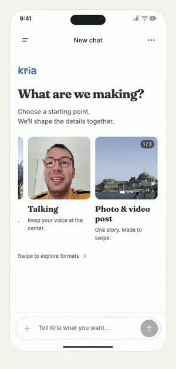
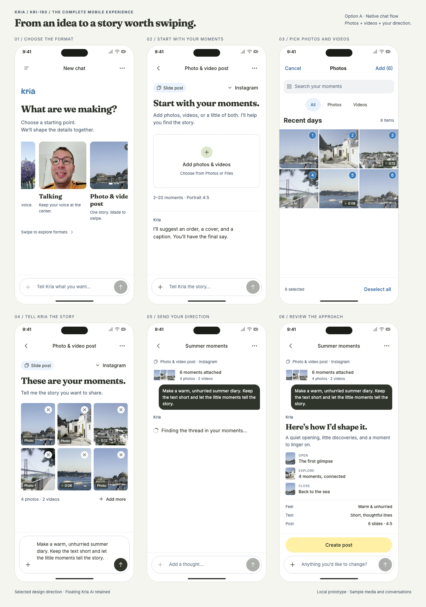
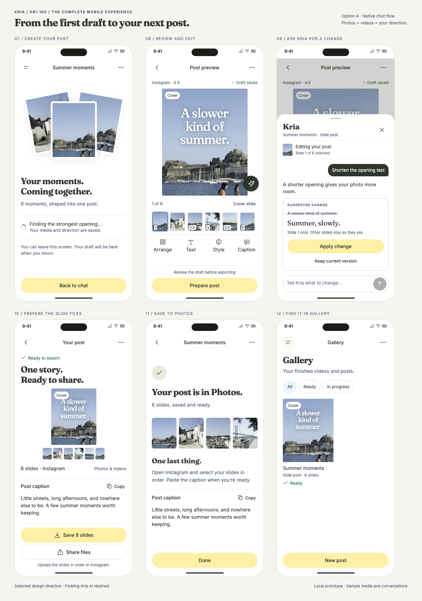

# KRI-160 — Slide posts for iPhone

Approved visual direction for [KRI-160](https://linear.app/kria/issue/KRI-160/the-slide-post-for-ios), recorded on 2026-09-22. **Option A: preview first, with the floating Kria AI button.** This package is the design handoff; native implementation and engineering qualification remain pending.

## Review the design

- [Creation flow: choose format → add photos/videos → prompt Kria → agree on direction](full-experience-start.png)
- [Finish: create → review/edit → ask Kria → export → save → Gallery](full-experience-finish.png)
- [Floating Kria AI interaction](approved-A.png)
- [Animated format cover](format-cover-swipe.gif)
- [Implementation handoff and open decisions](handoff.md)







## Run the interactive walkthrough

From the repository root, run:

```sh
python3 -m http.server 56715 --bind 127.0.0.1
```

Open <http://127.0.0.1:56715/docs/reviews/kri-160/prototype/>. If that port is in use, choose another port in the command and URL. No build, package installation, credentials, API server, or database is required.

The sidebar lets reviewers jump to individual screens. To start with the animated final format card in view, append `?screen=format&focus=post`. Storyboard views are available at `?board=journey&part=start`, `?board=journey&part=finish`, and `?board=approved`.

Serve the **repository root**, because the prototype reuses tracked media and fonts through relative URLs. It does not depend on an author's home directory or gstack installation. GitHub renders the handoff and screenshots; download/serve the checkout to interact with the HTML. A localhost URL works only on the machine running the server.

## Accepted design details

1. Photo & video post is last in the format carousel, immediately after Talking to camera.
2. Its square cover shows one edge-to-edge image at a time. A horizontal swipe cycles photo → muted video → photo with synchronized pagination and a count. Pause/Play is a separate control; Reduce Motion keeps the first frame static.
3. The complete creation journey retains the existing chat composer, mixed Photos/Files selection, optional prompt, direction approval, and explicit Create post action.
4. Review uses Option A's large preview and ordered thumbnails. The 52pt floating Kria button opens contextual editing chat, with proposed changes applied explicitly and undo available.
5. The finished post is separate ordered slide files plus a caption. Save/export and Gallery are included in the walkthrough.

## Prototype limits

All AI responses, imports, creation progress, draft saves, permissions, file exports, and Gallery persistence are simulated. Media are existing repository demo assets. No prompt or media is sent to an AI service, and nothing is written to Photos, Files, the clipboard, or social apps. Reloading resets in-memory changes. Other format cards are visual context and do not launch their flows.

The native implementation must use actual iOS pickers, permissions, sheets, and accessible controls. Native rendering, original-media consent, Photos ordering/partial-save recovery, draft version conflicts, and AI editing scope still require engineering decisions. The full seven-pass design review and engineering review are not complete; visual approval is not build clearance.

## Asset provenance

The prototype uses `src/apps/web/public/landing/raw-story/` for sample photos/videos, `src/apps/web/public/plan/type-posters/` for existing format covers, `src/apps/web/public/fonts/` for Inter/Fraunces, and `src/apps/ios/Kria/Resources/DynaPuff.ttf` for the illustrative wordmark. Native implementation must reuse the approved wordmark asset. No duplicate source media or fonts are added here.

## Verification

The packaged prototype is checked through a static server rooted at the checkout: full creation/edit/export journey, Photos and Files selection, prompt retention, local sample video playback, floating AI apply/undo, permission denial to Files, and responsive layouts at 375/393/430px. Cover checks include square framing, horizontal swipes, Pause/Play, offscreen pause, and Reduce Motion. Runtime errors and failed asset requests are checked. These browser checks do not certify native or backend behavior.
