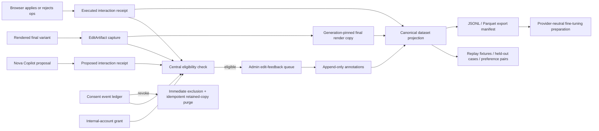

# Edit Feedback, Evaluation, and Fine-Tuning Workbench

Status: reviewed for implementation
Owner: Emir
Branch: `codex/edit-feedback-workbench`
Depends on: PR #896 deployed and canary-passed

## Outcome

Create a privacy-safe learning loop that lets Emir review exact rendered edits, annotate what was good or bad at frame-level precision, and export consent-safe evaluation and preference datasets without ever treating a model proposal as if the browser actually applied it.

Production model promotion remains manual. This PR prepares evidence, datasets, and provider-neutral training inputs; it does not automatically fine-tune or replace a model.

## Product contract

- Emir is the sole authoritative reviewer for the first 100–300 artifacts.
- Eligible artifacts are exact final renders plus derived poster/contact sheet only. Raw uploads, source clips, base videos, and intermediate renders are never retained for training.
- Internal accounts are eligible when explicitly marked internal. Customer artifacts require an explicit active training-consent grant.
- Revocation excludes data synchronously from list/playback/export and asynchronously deletes generation-pinned training copies. Re-consent never revives artifacts captured under an older revoked grant.
- Reviews are append-only. Corrections supersede earlier annotations instead of updating or deleting them.
- Dataset splits are grouped by creator and plan item. If there are too few independent creators, tuning readiness is blocked rather than weakening the leakage boundary.

## Architecture

### Trust boundaries

1. The model can propose operations, but only the client execution receipt records whether those operations were applied, rejected, stale, unsupported, or had no effect.
2. Mutable `Job.assembly_plan`, signed URLs, and raw `AgentRun` payloads are references, not canonical training records.
3. Every admin list, detail, playback, annotation, and export route is protected by the backend admin token and calls the same fail-closed eligibility service.
4. Export records use an explicit allowlist and pseudonymous grouping IDs. They exclude emails, names, raw transcripts, raw storage paths, signed URLs, and whole JSONB/model payloads.

## Durable data contracts

### Internal account grants

Add an operator-owned internal-account marker. Do not infer this from email domain, synthetic job shape, or authentication provider.

### TrainingConsent

Append-only grant/revoke event ledger with creator, purpose, policy/terms version, source, effective time, idempotency key, and optional reference to the grant being revoked. An artifact binds to the exact grant event that made it eligible.

### EditArtifact

Append-only exact render identity: creator, plan item, job and variant, artifact kind, render generation/hash/receipt, proposal/media identity, prompt/model provenance, storage path+generation, dimensions/duration, parent artifact, capture origin, eligibility basis, consent event, and deterministic split assignments.

Only `final_render`, `poster`, and `contact_sheet` are valid artifact kinds.

### EditInteractionReceipt

Append-only two-stage event contract:

- server persists `proposed` with utterance, inferred intent, exact proposed operations and digest, prompt/model versions, and before-state hash;
- browser posts an `executed` child with stable client event ID, applied/no-effect/rejected/stale/failed outcome, rejection reasons, and before/after hashes.

Only execution receipts whose after hash matches a canonical saved revision/render receipt may be paired with a rendered artifact.

### EditFeedbackAnnotation

Append-only dimension rating with exact artifact identity, `good|bad|mixed|not_applicable`, rationale, optional inclusive frame range, reviewer identity, and optional superseded-annotation reference. Rationale is required for substantive ratings. Effective state is the newest non-superseded leaf.

### Retention and export records

Add immutable retention-event and dataset-export manifest records for copy, purge, build, ready, and failed states. Persist storage generation and content hash. Never persist signed URLs.

## Backend work

1. Add an additive migration after `0079` for internal grants, consent events, artifacts, interaction receipts, annotations, retention events, and export manifests with checks, indexes, idempotency constraints, and safe deletion behavior.
2. Add ORM models and typed schemas. Application write paths are append-only; privacy deletion remains allowed.
3. Add `training_eligibility.py` as the single fail-closed policy used at capture and every read/export boundary.
4. Capture proposed Copilot receipts server-side and add an idempotent client execution-receipt endpoint. Wire the editor hook to post actual application results without blocking the edit experience; retry safely by client event ID.
5. Register exact final render artifacts from verified render receipts. Copy only the final generation to `users/{creator_id}/edit-feedback/{artifact_id}/final.mp4`; derive poster/contact sheet from that copy.
6. Add revocation handling that excludes synchronously and queues generation-pinned purge. Account deletion dispatches the same purge path.
7. Add admin list/detail/annotation/export endpoints under `/admin/edit-feedback`, all protected by `_require_admin`, with stable cursor/order semantics and server-signed playback URLs.
8. Add canonical dataset projection, creator/plan-item grouped splits, comparable-lineage preference construction, replay/held-out generation, JSONL and Parquet encoders, export manifests, and a provider-neutral `prepare_edit_training` command.
9. Add training-readiness metrics: at least 100 fully reviewed eligible artifacts, at least three independent creator groups, no split leakage, and per-dimension coverage. Export or preparation never promotes a model.
10. Guard legacy eval fixture exporters so they cannot scan or export user-derived customer content without the same eligibility policy.

## Admin workbench

Build `/admin/edit-feedback` with:

- server-side pagination and filters for format, language, media mix, date, prompt/model version, review state, and quality/edit signal;
- stratified queue coverage across formats, languages, media mixtures, prompt versions, successful outputs, and heavily edited outputs;
- signed-url-safe video playback using `StableVideo`;
- a read-only exact timeline using existing timeline scale/time helpers;
- frame-accurate notes and ratings for overall quality, instruction fit, hook, pacing/cuts, clip selection/order, captions/text, transitions, music/audio, and effects/overlays;
- append-only correction UX, save-error recovery, and explicit current/superseded annotation state;
- keyboard navigation: Arrow seek, Shift+Arrow larger seek, Home/End, Space play/pause, accessible segment buttons, Escape/focus restoration for detail;
- URL-backed filters, stable selection during refresh, an `aria-live` status region, native controls, and 44px targets.

The admin nav gains an accessible Edit Feedback entry and horizontal overflow behavior on narrow screens.

## Dataset and evaluation rules

- Canonical records contain media summaries, user intent, proposed plans/operations, actual execution receipts, human labels, and version provenance.
- Replay fixtures target Edit Guide, Edit Proposal, and Edit Copilot. Held-out cases never enter training.
- Preference pairs require comparable lineage: same agent, creator/plan item, media-analysis identity, intent/brief, and parent artifact. Parser failures and unsupported operations are not negative preferences without a human label.
- Stable pseudonymous creator and plan-item group IDs use a server secret. Raw IDs are excluded from exports.
- JSONL and Parquet are two encoders over one typed canonical record schema and manifest.
- Export objects live under a private short-lived `training-exports/` prefix covered by lifecycle deletion.
- Revocation removes retained server copies and excludes future exports; already downloaded external datasets cannot be clawed back and this limitation must be documented.

## Failure modes and handling

| Failure | Required behavior |
|---|---|
| Browser applies only some proposed operations | Persist actual per-op execution result; never infer success from the model reply. |
| Execution receipt retries after a timeout | Deduplicate by creator + client event ID and return the original receipt. |
| Saved revision does not match execution after hash | Keep receipt for audit, but do not pair it to the artifact. |
| Consent revoked during export | Export snapshot rechecks eligibility; build aborts/excludes the revoked artifact before ready state. |
| Signed URL expires during review | Refresh detail and fall forward through `StableVideo`; never persist the URL. |
| Artifact copy or derived media fails | Record a failed retention event; keep product render untouched; omit from eligible review/export. |
| Purge is retried | Exact-generation delete is idempotent; deleted/missing is success. |
| Too few creator groups | Dataset readiness reports blocked; no item-level fallback split. |
| Annotation save fails | Preserve local draft, announce error, allow retry; do not fabricate an effective rating. |
| Concurrent correction | Both rows remain; deterministic newest non-superseded leaf wins. |
| Large export through web proxy | Build async to object storage and download via fresh signed URL. |

## Verification plan

### Backend

- migration upgrade/downgrade and schema-chain tests;
- internal eligible, customer denied by default, explicit consent, revoke, regrant isolation, and account deletion;
- append-only corrections, rationale rules, frame bounds, and concurrent correction resolution;
- proposed-to-executed Copilot receipt E2E with idempotent retry, stale/no-effect/rejected reasons, and render-hash pairing;
- artifact version/generation identity, final-render-only retention, signed URL refresh, copy failure, and idempotent purge;
- admin authorization, filters/pagination, stable ordering, eligibility recheck, and N+1 query guard;
- JSONL/Parquet canonical parity, PII/path/transcript/signed-URL denylist, export snapshot revocation, lifecycle prefix, and manifest hash;
- creator and plan-item split isolation, minimum creator readiness, comparable preference pairs, replay fixtures, and provider-neutral preparation;
- legacy exporter customer-data exclusion.

### Frontend

- list/detail empty/loading/error states and URL-backed filters;
- `StableVideo` signed URL refresh;
- keyboard seek/play/pause/home/end, accessible segment labels, dialog Escape and focus restoration;
- frame-bound annotations, dimension ratings, correction flow, save failure/retry;
- polling does not steal focus or collapse the selected item;
- Copilot execution-receipt success, partial rejection, failure, retry, and idempotency.

### Release gates

- backend Ruff, format check, focused and full pytest;
- frontend Jest, lint, and TypeScript;
- structural Edit Guide/Proposal/Copilot evals;
- `scripts/preship-check.sh`;
- diff review, adversarial review, PR creation, mandatory autoship pre-merge approval gate, merge/deploy, and post-deploy admin/auth/export canary using internal data only.

## Not in scope

- Automatic production model promotion.
- Provider-specific training upload APIs.
- Retaining or exporting raw customer uploads.
- Retroactively enrolling previously rendered customer artifacts without an explicit consent grant covering prior artifacts.
- Automatically importing the linked Corfu production draft into the training set.

## Parallel implementation lanes

1. Data contracts, migration, eligibility, retention, and consent.
2. Copilot execution receipts and artifact capture.
3. Admin API and workbench.
4. Dataset projection, split/preference/replay/export/preparation.
5. Cross-cutting tests, privacy audit, docs, and release verification.

## GSTACK REVIEW REPORT

### Review summary

- Mode: full PR 2 plan review.
- Scope: accepted as one PR because every lane shares the same consent/eligibility and exact-artifact identity boundary; splitting the contracts from the workbench/export path would create a deploy window with misleading or unenforceable privacy semantics.
- Existing reuse: guided render receipts, proposal media digests, storage generation helpers, backend admin auth, `StableVideo`, and timeline math.
- Rejected shortcuts: reusing mutable `VideoFeedback`, treating `AgentRun` as execution truth, inferring internal status from email/synthetic auth, exporting whole JSONB rows, storing signed URLs, or deleting customer-facing renders on revoke.

| Run | Status | Findings |
|---|---|---|
| Architecture | clear after changes | Centralized eligibility, exact artifact identity, two-stage execution receipts, and async export boundaries are specified. |
| Code quality | clear | Existing render receipts, media digests, storage generation helpers, admin auth, and timeline utilities are reused instead of duplicated. |
| Tests | clear | Data safety, concurrency, UI keyboard behavior, export leakage, and end-to-end receipt-to-review coverage are explicit. |
| Performance | clear with guardrails | Batched admin reads, stable pagination, async export objects, capped queue queries, and no full editor embedding. |
| Privacy/security | clear after changes | Fail-closed eligibility at capture/read/export, explicit internal grants, append-only consent events, and generation-pinned purge. |
| Outside voices | incorporated | Three independent Luna audits found the execution-truth, consent, storage, signed-URL, split-leakage, and admin-auth hazards now captured above. |

### Decisions

- Consent is an append-only event ledger and artifacts bind to the exact grant event.
- Internal eligibility is an explicit operator-owned grant, not an email convention.
- Training copies stay under the creator's `users/{id}/edit-feedback/` prefix for account-purge coverage and are generation-pinned.
- Admin export is asynchronous with a manifest and short-lived private object; the Next.js proxy never buffers the full dataset.
- Parquet support uses one pinned library and the same canonical schema as JSONL.
- Creator-level split isolation is mandatory even when it blocks the first experiment.
- The initial 100–300 reviews are authored by Emir and model promotion is always manual.

### Plan quality

- Architecture: clear boundaries and authoritative identities defined.
- Data safety: fail-closed eligibility at every boundary; revoke and deletion paths explicit.
- Concurrency: idempotency keys, exact generations, export snapshot checks, and append-only correction semantics specified.
- Testability: each boundary has focused regression coverage and an end-to-end receipt-to-review path.
- Rollout: additive schema, internal-only canary, no automatic customer enrollment or model promotion.

VERDICT: PROCEED AS APPROVED. The plan is intentionally large, but its parts share one indivisible privacy and exact-execution contract. Splitting before that contract is live would create misleading partial behavior.

NO UNRESOLVED DECISIONS
